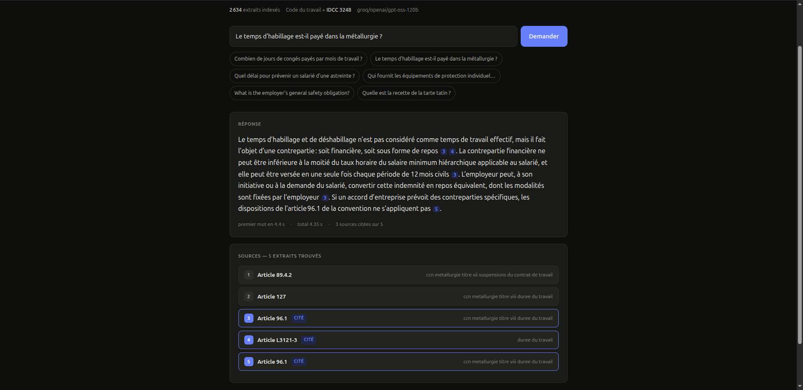

# Assistant droit du travail — RAG over French labour law

A question-answering assistant over the French **Code du travail** and the
**metallurgy collective agreement (IDCC 3248)**, built for a small industrial
company. Every answer cites the article it rests on, and the assistant refuses
to answer when the corpus does not contain the answer.

**Live demo:** <add the URL> · **Case study:** <add the URL>

<!-- Replace with a real screenshot: docs/screenshot-answer.png -->
<!--  -->

---

## Why this exists

An SME accumulates HR rules it never reads: the Labour Code, a collective
agreement of several hundred articles, internal procedures. Every week somebody
spends an hour looking up what the rule actually says about overtime, on-call
duty or dressing time.

A chatbot that answers such questions from memory is worse than useless — a
confident wrong answer about working time costs the company real money. So the
design goal here was never "sounds knowledgeable". It was **verifiable**:

- every statement carries the article number behind it, one click from the
  original text;
- when retrieval is not confident, the language model is **never called** — a
  prompt instruction to refuse is a request, skipping the call is a guarantee.

---

## Measured results

Retrieval is evaluated against 13 labelled questions whose correct articles were
verified against the built corpus, plus out-of-scope questions that must be
refused. Run it yourself: `python scripts/eval_retrieval.py --html report.html`.

| Strategy | Recall@1 | Recall@5 | MRR | Correct refusals |
|---|---|---|---|---|
| Dense only (e5-small) | 0.23 | 0.54 | 0.34 | 0 / 4 |
| BM25 only | 0.15 | 0.62 | 0.35 | 1 / 4 |
| Hybrid (RRF fusion) | 0.31 | 0.62 | 0.44 | 0 / 4 |
| **Hybrid + cross-encoder rerank** | **0.54** | **0.85** | **0.60** | **4 / 4** |

Recall@5 is the number that matters for answer quality: the generator receives
five extracts and picks from them. Recall@1 matters for the "primary source"
badge in the UI.

Corpus: 30 documents, 2 204 articles, 2 634 indexed extracts.

---

## Architecture

```
question
   │
   ├─ query preparation ─── accents restored, acronyms and synonyms expanded,
   │                        English bridged to French   (app/query_expansion.py)
   │
   ├─ dense search ──── multilingual-e5-small → Chroma ──┐
   │                                                     ├─ RRF fusion
   ├─ lexical search ── BM25 over article + body ────────┘      │
   │                                                            ▼
   ├─ cross-encoder rerank (top 20 → top 5)          (app/retriever.py)
   │        │
   │        └─ guardrail: reranker score below threshold → refuse, no LLM call
   │
   └─ generation ── numbered extracts + system prompt → LLM   (app/generator.py)
            │
            └─ citations resolved back to real article references
```

Two searches run in parallel because they fail on *different* questions. BM25
matches exact legal terms ("astreinte", "habillage", an article number) that
embeddings blur; dense search matches paraphrase that BM25 misses. Fusing them
by rank (RRF) needs no score calibration between an unbounded BM25 score and a
cosine.

The cross-encoder then reads each candidate together with the question. Its
score is what the guardrail thresholds — a bi-encoder cosine is a similarity,
not a confidence, and on this corpus everything lands between 0.77 and 0.90,
which no threshold can separate.

---

## Quick start

Requires Python 3.10+ and, for the local model, [Ollama](https://ollama.com).

```bash
git clone <repo-url> && cd rag-assistant
python3 -m venv .venv && source .venv/bin/activate
bash scripts/install.sh              # CPU-only torch, then the rest

cp .env.example .env                 # then set your provider (see below)

python scripts/build_corpus.py       # downloads and builds the corpus (~2 min)
python -m app.ingestion --reset      # embeds 2 634 extracts (~4 min on CPU)

python scripts/doctor.py             # checks every moving part
bash scripts/serve.sh --dev          # http://127.0.0.1:8077
```

`scripts/install.sh` installs the CPU wheel of torch before anything else.
Installing torch from PyPI pulls the CUDA build plus ~3 GB of `nvidia-*` wheels
that are dead weight on a CPU host — that alone is the difference between a
1.5 GB and a 6 GB environment.

### Choosing a language model

```bash
# Local — no key, no quota, nothing leaves the machine
LLM_PROVIDER=ollama
OLLAMA_MODEL=qwen2.5:7b-instruct

# Hosted — faster, needs a key and an activated tier
LLM_PROVIDER=mistral
MISTRAL_API_KEY=...
```

Local generation takes roughly 20-30 s on a laptop CPU, dominated by *prefill*
— the model reading the ~1 800-token prompt before it can emit a first token.
Streaming shortens the second half of that wait, not the first. A public demo
should use a hosted provider; the local configuration is what makes "your
documents never leave the building" a true statement rather than a slogan.

### Docker (home server)

```bash
cp .env.example .env          # set LLM_PROVIDER and, for a public URL, TUNNEL_TOKEN
docker compose up -d --build
docker compose logs -f rag
```

First boot takes about ten minutes — it downloads the corpus, the embedder and
the reranker, then indexes 2 634 extracts. After that, boots are seconds: the
models and the index live in named volumes, so rebuilding the image does not
throw them away.

Two things that are easy to get wrong:

- **Ollama runs on the host, not in the container.** The compose file maps
  `host.docker.internal` to the host gateway; without that entry every question
  fails with "cannot reach Ollama".
- **The port is published to `127.0.0.1` only.** The public entry point is the
  Cloudflare tunnel, and binding `0.0.0.0` would expose the API to the whole LAN
  while bypassing it.

To publish it, create a tunnel in the Cloudflare Zero Trust dashboard, point its
public hostname at `http://rag:8077`, put the token in `.env`, and:

```bash
docker compose --profile public up -d
```

---

## Commands

| Command | What it does |
|---|---|
| `python scripts/build_corpus.py` | Rebuild the corpus from DILA open data |
| `python -m app.ingestion --reset` | Chunk, embed and index the corpus |
| `python scripts/doctor.py` | Check config, corpus, index, retrieval, LLM |
| `python scripts/eval_retrieval.py --html report.html` | Benchmark the four retrieval strategies |
| `python scripts/calibrate_guardrail.py` | Recalibrate the refusal threshold on data |
| `python scripts/ask.py --demo` | Five questions straight through the library |
| `python scripts/ask_api.py "question"` | Query the running API, rendered readably |
| `python scripts/build_accent_map.py` | Regenerate the accent map from the corpus |
| `python tests/test_core.py` | Tests — no models, no API key, under a second |

---

## API

| Endpoint | Purpose |
|---|---|
| `GET /health` | Status, indexed chunk count, active model |
| `POST /query` | Question in, answer plus cited sources out |
| `POST /query/stream` | Same, as Server-Sent Events |
| `POST /ingest` | Add a document to the index |

The streaming endpoint sends the retrieved **sources first**, before the model
has produced a word. On CPU that is 2-3 seconds against 20 — the page shows the
articles while the model is still reading the prompt.

---

## What went wrong, and what it taught

The interesting part of this project is not the happy path.

**Plain dense retrieval was not good enough.** The first smoke test gave a
separation gap of +0.019 between the worst in-corpus question and the best
out-of-corpus one, and several correct articles were not retrieved at all.
Legal text is dense in near-identical boilerplate, so a bi-encoder maps most of
it into a narrow cone. Hybrid retrieval plus reranking took Recall@5 from 0.54
to 0.85.

**The evaluation was broken before the system was.** The first version compared
`"Article L3141-3"` against the label `"L3141-3"` and scored every strategy at
0.00 — a measurement bug that looked exactly like total failure. A benchmark you
have not tested is not a benchmark.

**Retrieval was not deterministic.** Chroma's `get()` does not promise an order,
that order became the BM25 document index, and the index became the tie-break
order everywhere downstream. Two runs over an identical index produced different
scores and a different calibrated threshold. Sorting chunks by content hash
fixed it; `tests/test_core.py` guards it.

**The refusal threshold was guessed, and it silently refused valid questions.**
It was set to 0.0 by hand while only out-of-scope refusals were measured. A real
question — is dressing time paid — scored −2.61 and was refused.
`scripts/calibrate_guardrail.py` now measures both kinds of error and weights a
false answer twice as heavily as a false refusal.

**A reranker is a ranker, not a veto.** An attempt to blend the reranker's order
back with the fusion order made things worse (Recall@1 0.54 → 0.46). The failed
experiment is documented in the code so nobody repeats it.

**Questions typed without accents broke retrieval.** Asked "Quel delai pour
prevenir un salarie", the correct article fell from rank 1 to rank 5: BM25 folds
accents on both sides, but the embedder sees `delai` and `délai` as different
words. `app/accents_fr.py` is generated from the corpus itself, keeping only
unambiguous mappings — which is what keeps `sur`/`sûr` and `cote`/`côte` out.

---

## Known limitations

- **Recall@1 is 0.54.** Good enough because the generator gets five extracts,
  not good enough to label a single "the" source with confidence.
- **One question fails on every strategy**: the employee threshold for setting up
  a CSE. The corpus has 312 chunks about the CSE and the distinguishing signal is
  the phrase "onze salariés", which neither lexical nor semantic search isolates.
- **Local generation is slow** on an older CPU (20-30 s, prefill-bound).
- **Answers are only as current as the corpus snapshot.** Rebuild it to refresh.
- **This is not legal advice.** It reads public legal texts and shows where each
  statement comes from. Interpretation is a lawyer's job.

---

## Data sources

Both corpora are French government open data, republished as structured JSON by
[SocialGouv](https://github.com/SocialGouv):

- [legi-data](https://github.com/SocialGouv/legi-data) — Code du travail
- [kali-data](https://github.com/SocialGouv/kali-data) — collective agreements,
  here [IDCC 3248](https://www.legifrance.gouv.fr/conv_coll/id/KALICONT000046993250)

The corpus is not committed; `scripts/build_corpus.py` reproduces it exactly.

## Stack

FastAPI · ChromaDB · sentence-transformers (`multilingual-e5-small`,
`mmarco-mMiniLMv2` cross-encoder) · Ollama or Mistral · vanilla HTML/JS frontend
